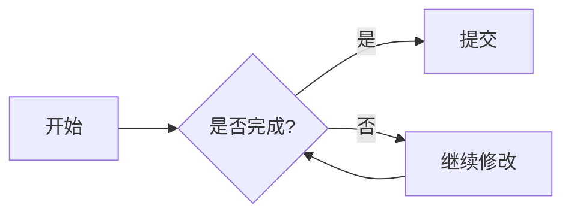
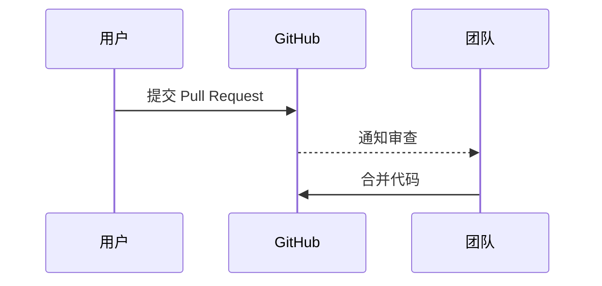
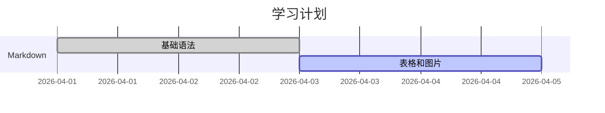

# Markdown 用法教程

Markdown 是一种轻量级标记语言。它的目标很简单：用接近纯文本的写法，写出带标题、列表、链接、图片、代码块、表格等格式的文档。

这篇教程适合：

- 第一次学习 Markdown 的新手
- 想写 GitHub README、博客、教程文档的人
- 想快速查 Markdown 常用语法的人

如果你想先了解“怎么把 Markdown 学成一套写作能力”，建议先看 [Markdown 学习导读](LEARNING_GUIDE.md)。

## 推荐入口

- [Markdown 学习导读](LEARNING_GUIDE.md)：README 写作、博客结构、Mermaid、平台差异和外部资源
- [Markdown 常见问题](FAQ.md)：换行、标题、图片、路径、表格、代码块和 Mermaid 常见坑
- [Markdown 写作进阶指南](WRITING_GUIDE.md)：README、教程、博客、表格、代码块和 Mermaid 的写作组织方法
- [README 审查清单](README_REVIEW_CHECKLIST.md)：从第一屏、目录、安装运行、代码块、FAQ 和许可证角度检查 README
- [Markdown 示例与模板](examples/README.md)
- [README 模板](examples/readme-template.md)

## 1. Markdown 文件是什么

Markdown 文件通常以 `.md` 结尾，例如：

```text
README.md
notes.md
tutorial.md
```

你可以用 VS Code、Typora、Obsidian、Notion、GitHub、CSDN、Hexo 等工具编辑或预览 Markdown。

需要注意：不同平台对 Markdown 的扩展支持不完全一样。标准语法通常都能用，数学公式、Mermaid 图表、脚注、主题标签等扩展语法要看平台是否支持。

## 2. 标题

使用 `#` 表示标题，最多支持 6 级。

```markdown
# 一级标题
## 二级标题
### 三级标题
#### 四级标题
##### 五级标题
###### 六级标题
```

建议：

- 一篇文章只使用一个一级标题。
- 标题层级不要跳跃，例如不要从二级标题直接跳到四级标题。
- `#` 后面要加一个空格。

## 3. 段落和换行

普通文字直接写就是段落。

```markdown
这是第一段。

这是第二段。
```

Markdown 中一个空行表示分段。

如果只想在同一段里强制换行，可以在行尾加两个空格，或者使用 HTML 的 `<br>`：

```markdown
第一行。  
第二行。
```

## 4. 加粗、斜体和删除线

```markdown
*斜体*
_斜体_

**加粗**
__加粗__

***粗斜体***

~~删除线~~
```

效果含义：

- `*文本*`：斜体
- `**文本**`：加粗
- `***文本***`：粗斜体
- `~~文本~~`：删除线

## 5. 引用

使用 `>` 表示引用。

```markdown
> 这是一段引用。
```

引用可以嵌套：

```markdown
> 第一层引用
>
> > 第二层引用
```

引用适合用来放说明、摘录、提醒或别人说过的话。

## 6. 列表

### 无序列表

使用 `-`、`+` 或 `*` 都可以。建议统一使用 `-`。

```markdown
- 苹果
- 香蕉
- 橘子
```

嵌套列表用缩进：

```markdown
- 前端
  - HTML
  - CSS
  - JavaScript
- 后端
  - Python
  - Go
```

### 有序列表

```markdown
1. 第一步
2. 第二步
3. 第三步
```

很多 Markdown 渲染器会自动修正编号，所以也可以写成：

```markdown
1. 第一步
1. 第二步
1. 第三步
```

### 任务列表

```markdown
- [x] 已完成
- [ ] 未完成
```

任务列表常用于 TODO、计划、项目进度。

## 7. 链接

### 行内链接

```markdown
[链接文字](https://example.com)
```

示例：

```markdown
[GitHub](https://github.com)
```

### 带标题的链接

```markdown
[GitHub](https://github.com "代码托管平台")
```

### 引用式链接

当同一个链接会出现多次时，可以使用引用式链接：

```markdown
这是一个 [GitHub][github] 链接。

[github]: https://github.com
```

## 8. 图片

图片语法比链接多一个 `!`。

```markdown

```

本地图片：

```markdown

```

建议：

- `[]` 中写清楚图片说明，方便无障碍阅读和图片加载失败时理解。
- 图片路径尽量使用相对路径，方便仓库迁移。
- GitHub README 中的本地图片要确保图片文件也提交到了仓库。

## 9. 行内代码和代码块

### 行内代码

使用反引号包裹短代码、命令、文件名。

```markdown
使用 `git status` 查看当前状态。
```

### 代码块

使用三个反引号创建代码块，并建议标注语言。

````markdown
```bash
git status
git add .
git commit -m "docs: update readme"
```
````

常见语言标识：

```text
bash
javascript
python
html
css
json
markdown
yaml
```

如果要在 Markdown 教程里展示代码块本身，可以用四个反引号包住三个反引号，避免提前结束代码块。

## 10. 表格

```markdown
| 命令 | 作用 | 示例 |
| :--- | :--- | :--- |
| `ls` | 查看文件 | `ls -lah` |
| `cd` | 切换目录 | `cd /home` |
| `pwd` | 查看当前目录 | `pwd` |
```

对齐方式：

```markdown
| 左对齐 | 居中 | 右对齐 |
| :--- | :---: | ---: |
| A | B | C |
```

说明：

- `:---` 左对齐
- `:---:` 居中
- `---:` 右对齐

## 11. 分割线

使用三个或更多 `-`、`*`、`_`。

```markdown
---
```

常用于分隔文章段落。

## 12. 转义字符

如果你想显示 Markdown 特殊符号本身，可以用反斜杠转义。

```markdown
\*这不会变成斜体\*
\# 这不会变成标题
```

常见需要转义的字符：

```text
\ ` * _ { } [ ] ( ) # + - . ! |
```

## 13. 脚注

部分平台支持脚注，例如 GitHub、部分博客系统。

```markdown
这里有一个脚注[^1]。

[^1]: 这是脚注内容。
```

如果平台不支持脚注，可以改用普通括号说明。

## 14. 数学公式

部分平台支持 LaTeX / KaTeX / MathJax 数学公式。

行内公式：

```markdown
$E = mc^2$
```

块级公式：

```markdown
$$
\Gamma(z) = \int_0^\infty t^{z-1}e^{-t}dt
$$
```

注意：数学公式不是所有 Markdown 渲染器都支持。写 GitHub、CSDN、Hexo、Typora 文档前，最好先确认平台规则。

## 15. Mermaid 图表

很多平台支持 Mermaid，可以用文本画流程图、时序图、甘特图等。

### 流程图

````markdown

````

### 时序图

````markdown

````

### 甘特图

````markdown

````

注意：Mermaid 是扩展能力，不属于最基础的 Markdown。不同平台渲染效果可能不同。

## 16. 内嵌 HTML

Markdown 可以混写 HTML，但不同平台支持程度不同。

```markdown
<details>
<summary>点击展开</summary>

这里是隐藏内容。

</details>
```

建议只在确实需要时使用 HTML。写通用文档时，优先使用 Markdown 标准语法。

## 17. 常见平台扩展语法

### CSDN 常见扩展

CSDN 编辑器常见支持：

- 任务列表
- KaTeX 数学公式
- Mermaid 图表
- 图片拖拽上传
- 代码高亮

这些语法在 CSDN 里可能显示正常，但换到其他平台时不一定完全兼容。

### Hexo / 安知鱼主题标签

安知鱼主题提供了很多 Tag Plugins，例如彩色文字、按钮、选项卡等。它们的写法类似：

```markdown


```

这类写法不是通用 Markdown，而是 Hexo 主题扩展。只有安装并启用对应主题或插件时才会生效。

适合使用的场景：

- 个人博客
- Hexo 主题文章
- 需要特殊视觉效果的页面

不适合使用的场景：

- GitHub README
- 通用教程文档
- 需要跨平台迁移的文档

## 18. Markdown 写作建议

### 一篇教程的基本结构

```markdown
# 标题

简短介绍这篇文章解决什么问题。

## 背景

为什么需要学这个？

## 步骤

1. 第一步
2. 第二步
3. 第三步

## 常见问题

### 问题一

回答。

## 总结

回顾最重要的内容。
```

### 写作习惯

- 标题层级清楚。
- 代码块标注语言。
- 命令前后说明它做什么。
- 图片写替代文本。
- 表格不要太宽。
- 不要把平台专属语法当作通用语法。
- 重要命令和危险操作要写提醒。

### README 模板

如果你不知道项目首页该写什么，可以参考：

- [Markdown 示例与模板](examples/README.md)
- [README 模板](examples/readme-template.md)

## 19. 常用语法速查

| 目标 | 写法 |
| :--- | :--- |
| 标题 | `## 二级标题` |
| 加粗 | `**加粗**` |
| 斜体 | `*斜体*` |
| 删除线 | `~~删除线~~` |
| 引用 | `> 引用内容` |
| 无序列表 | `- 列表项` |
| 有序列表 | `1. 列表项` |
| 任务列表 | `- [ ] 待办` |
| 链接 | `[文字](https://example.com)` |
| 图片 | `` |
| 行内代码 | `` `code` `` |
| 代码块 | 三个反引号 |
| 表格 | `| 表头 | 表头 |` |
| 分割线 | `---` |
| 脚注 | `文本[^1]` |

## 20. 参考来源

本教程整理参考了当前目录中的旧资料：

- `CSDN.md`
- `Markdown_Basics01.md`

也参考了安知鱼博客关于 Hexo 主题标签插件的说明：

- `https://blog.anheyu.com/posts/d50a.html`

其中，通用 Markdown 语法适合大多数平台；安知鱼 Tag Plugins 属于 Hexo 主题扩展，请按使用场景选择。
