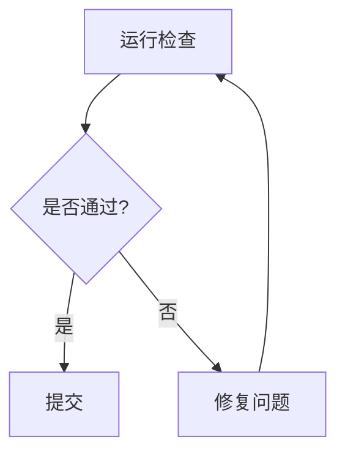
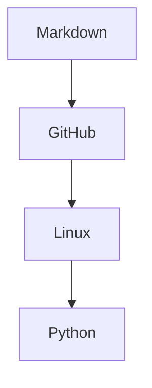

# Mermaid 流程图示例

Mermaid 可以用文本画流程图。它适合说明流程、状态转换和协作关系。

## 基础流程图

````markdown

````

## 带判断的流程图

````markdown

````

## 学习路线图

````markdown

````

## 注意事项

- Mermaid 不是所有平台都支持。
- 节点文字含中文、空格或标点时，建议用引号。
- 图不要太复杂，复杂流程可以拆成多个图。
