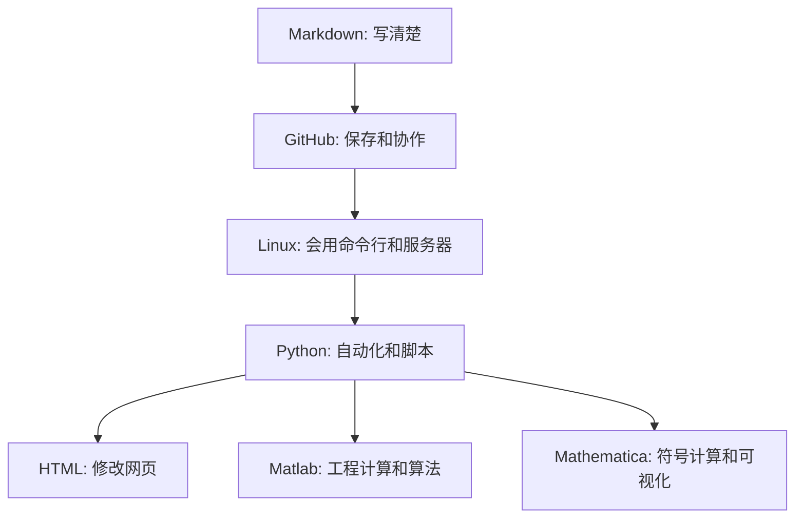

# 知识地图总览

这份地图帮助你理解仓库中各目录之间的关系。它回答一个问题：我现在学的东西，和其他目录有什么联系？

## 总体路线

## 各目录定位

| 目录 | 主要解决的问题 | 学完后的能力 |
| :--- | :--- | :--- |
| `Markdown` | 如何写清楚文档 | 写 README、教程、学习笔记 |
| `Github` | 如何保存和协作修改 | 提交、推送、分支、PR |
| `Linux` | 如何使用命令行和服务器 | 文件操作、SSH、服务排查 |
| `Python` | 如何写自动化脚本 | 文件处理、数据处理、小工具 |
| `HTML` | 如何修改静态网页 | 改页面结构、样式、交互 |
| `Matlab` | 如何做工程计算和算法实验 | 矩阵、绘图、优化、神经网络 |
| `Mathematica` | 如何做符号计算和数学可视化 | 公式推导、微积分、绘图 |
| `docs` | 如何组织学习过程 | 路线、练习、排错、复盘 |
| `scripts` | 如何维护仓库文档 | 检查链接、代码块和 README |

## 按目标选择路线

### 我想写好项目文档

推荐路线：

1. [Markdown 学习导读](../Markdown/LEARNING_GUIDE.md)
2. [README 模板](../Markdown/examples/readme-template.md)
3. [文档整理规范](STYLE_GUIDE.md)
4. [GitHub 学习导读](../Github/LEARNING_GUIDE.md)

### 我想管理自己的代码仓库

推荐路线：

1. [GitHub 新手入门教程](../Github/README.md)
2. [GitHub 学习导读](../Github/LEARNING_GUIDE.md)
3. [新手常见问题排查手册](TROUBLESHOOTING.md)

### 我想能操作 VPS

推荐路线：

1. [Linux 学习导读](../Linux/LEARNING_GUIDE.md)
2. [Linux 完全新手地图](../Linux/docs/part0-newbie-map.md)
3. [VPS 操作安全清单](../Linux/docs/part4-vps-tools/4.2-vps-safety-checklist.md)

### 我想写自动化脚本

推荐路线：

1. [Python 学习导读](../Python/LEARNING_GUIDE.md)
2. [Python 基础教程](../Python/Basics/README.md)
3. [Auto_scripts 脚本索引](../Python/Auto_scripts/README.md)

### 我想做算法和建模

推荐路线：

1. [Matlab 学习导读](../Matlab/LEARNING_GUIDE.md)
2. [Matlab 示例运行指南](../Matlab/RUNNING_EXAMPLES.md)
3. [Python 多目标优化示例](<../Python/Multi-Objective Optimization/README.md>)
4. [Mathematica 学习导读](../Mathematica/LEARNING_GUIDE.md)

## 学习策略

- 先读入口导读，再进细节教程。
- 先跑通最小示例，再改参数。
- 先记录报错，再尝试修复。
- 不同工具之间做对照学习，例如 Python 和 Matlab 的矩阵、Matlab 和 Mathematica 的绘图。

## 下一步

如果你不知道从哪里开始，先按 [30 天学习计划](30_DAY_PLAN.md) 走一遍。走完后，再根据自己的目标选择深入方向。
